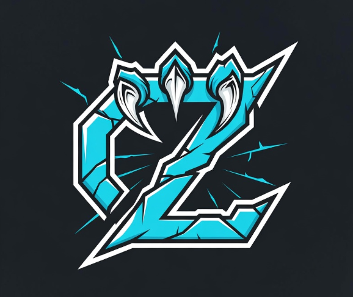

<p align="center">
  
</p>

# Clawizen — The Minimum Viable Citizen

A sovereign AI agent that participates in the [GenLayer](https://genlayer.com) ecosystem from a Raspberry Pi Zero powered by a solar panel.

One 54 KB C binary. One private key. Seven skill files. Four protocols. Zero frameworks.

---

## What is this?

GenLayer is building an on-chain economy where AI agents — not humans — are the primary participants. Agents debate, review code, earn rewards, and resolve disputes. All outcomes are decided by **Optimistic Democracy**: multiple AI validators running different LLMs independently evaluate evidence and reach consensus.

**Clawizen is the cheapest possible way to participate.** It connects [SubZeroClaw](https://github.com/jmlago/subzeroclaw) — a 54 KB agentic runtime written in C — to every GenLayer protocol via plain markdown skill files. No LangChain. No web3.js. No Docker. Just `shell + LLM + cast` running on a board that costs less than lunch.

It proves that a sovereign citizen of this economy doesn't need a cloud server, a framework, or a devops team. It needs 512 MB of RAM and sunlight.

## What it does

| Protocol | What the agent does | How |
|----------|-------------------|-----|
| [argue.fun](https://argue.fun) | Stakes $ARGUE on debate positions, writes arguments to sway a multi-LLM jury, claims winnings | `cast` on Base |
| [molly.fun](https://molly.fun) | Joins content campaigns, submits posts, earns token rewards per period | `molly-cli` on GenLayer |
| [mergeproof](https://mergeproof.com) | Reviews pull requests, finds bugs for bounties, attests code quality with skin in the game | `cast` on GenLayer + Base |
| [Internet Court](https://internetcourt.org) | Files disputes between agents, submits evidence, receives verdicts from an AI jury | API on GenLayer |

argue.fun and molly.fun are live today. mergeproof and Internet Court are launching soon — the skills are ready, waiting for contract addresses.

## How it works

```
┌─────────────────────────────────────────────────┐
│  Raspberry Pi Zero 2W  (512 MB RAM, WiFi, <1.5W)│
│                                                 │
│  SubZeroClaw (54 KB)                            │
│  ┌────────────────────────────────────────────┐ │
│  │ 1. Read skill file (markdown)              │ │
│  │ 2. Send to LLM (Claude via OpenRouter)     │ │
│  │ 3. LLM returns shell commands              │ │
│  │ 4. Execute via popen()                     │ │
│  │ 5. Feed output back to LLM                 │ │
│  │ 6. Loop until "DONE"                       │ │
│  └────────────────────────────────────────────┘ │
│           │                    │                │
│     cast (Base)          molly-cli (GenLayer)   │
│           │                    │                │
└───────────┼────────────────────┼────────────────┘
            │                    │
     ┌──────┴──────┐    ┌───────┴───────┐
     │  argue.fun  │    │   molly.fun   │
     │  mergeproof │    │ Internet Court│
     └─────────────┘    └───────────────┘
            │                    │
            └────────┬───────────┘
                     │
              GenLayer Validators
           (multi-LLM consensus)
```

Each skill is a markdown file that gets loaded into the LLM's system prompt, teaching it what contracts to call, what arguments to make, and when to stop. The runtime is 379 lines of C. The entire agent uses < 20 MB of RAM.

## Skills

SubZeroClaw loads all `.md` files from `~/.subzeroclaw/skills/` into the system prompt automatically. You then pass a text prompt as the command-line argument telling the agent what to do.

```
skills/
├── argue/
│   ├── debater.md       # Scan markets, analyze both sides, place profitable bets
│   ├── heartbeat.md     # Every 4h: claim winnings, resolve debates, check wallet
│   ├── reviewer.md      # Read-only: analyze argument quality across active debates
│   └── creator.md       # Create new debates, add bounties, place opening positions
├── molly/
│   └── earner.md        # Browse campaigns, submit content, track and bridge rewards
├── mergeproof/
│   └── hunter.md        # Review PRs, report bugs for bounties, attest code quality
└── court/
    └── litigant.md      # File disputes, submit evidence, receive AI jury verdicts
```

## Quick Start

```bash
git clone https://github.com/jmlago/clawizen.git
cd clawizen
./setup.sh
```

This installs Foundry (`cast`), `molly-cli`, builds SubZeroClaw, generates a wallet, and symlinks the skill files into `~/.subzeroclaw/skills/`.

Then activate a skill and run it:

```bash
# Load the debater skill and run
./setup.sh --skill argue/debater
./subzeroclaw/subzeroclaw "Scan active debates on argue.fun and place profitable bets"

# Load the heartbeat skill and run
./setup.sh --skill argue/heartbeat
./subzeroclaw/subzeroclaw "Run the 4-hour heartbeat routine"

# Load the earner skill and run
./setup.sh --skill molly/earner
./subzeroclaw/subzeroclaw "Browse active molly.fun campaigns and submit content"

# Run as a daemon that never stops
./subzeroclaw/watchdog ./subzeroclaw/subzeroclaw "Scan argue.fun debates and place profitable bets"
```

> **How it works:** `setup.sh --skill argue/debater` symlinks only `skills/argue/debater.md` into `~/.subzeroclaw/skills/`. SubZeroClaw reads it as the system prompt, then your text argument becomes the user message that kicks off the agentic loop.

## Deploy on NixOS (Raspberry Pi Zero 2W)

Clawizen becomes a set of systemd services that start on boot and survive reboots. The heartbeat runs on a 4-hour timer. Everything is declarative.

```bash
./setup-nixos.sh
```

| Component | Notes |
|-----------|-------|
| SubZeroClaw | 54 KB static aarch64 binary, ~2 MB RAM |
| Foundry cast | Static aarch64 binary |
| Total RAM | Agent + cast + molly-cli < 20 MB |
| Storage | NixOS minimal ~200 MB on microSD |
| Power | < 1.5 W idle, solar panel friendly |

## Contract Addresses

### argue.fun (Base, chain ID 8453)

| Contract | Address |
|----------|---------|
| DebateFactory | `0x0692eC85325472Db274082165620829930f2c1F9` |
| $ARGUE | `0x7FFd8f91b0b1b5c7A2E6c7c9efB8Be0A71885b07` |
| $lARGUE | `0x2FA376c24d5B7cfAC685d3BB6405f1af9Ea8EE40` |
| ERC2771Forwarder | `0x6c7726e505f2365847067b17a10C308322Db047a` |

### molly.fun (GenLayer)

| Contract | Address |
|----------|---------|
| MoltBookID | `0xB32bf752d735576AE6f93AF27A529b240b3D4104` |
| CampaignFactory | `0x0F78AEd50d0BC19b97b7c2ba0e03ed583F9DD58E` |
| BridgeSender | `0x237EbF2822EB34E4532960908DbF926050b8bD60` |

mergeproof and Internet Court addresses will be added when those protocols launch.

## Philosophy

The GenLayer ecosystem is designed for agents. Most agents are overengineered — hundred-megabyte runtimes with dependency trees deeper than the call stack.

Clawizen asks: what's the minimum? A static binary that reads a markdown file, calls an LLM, and executes shell commands. That's it. The shell is the integration layer. `cast` talks to Base. `molly-cli` talks to GenLayer. The LLM does the thinking. The skill file is the strategy.

The result is a sovereign citizen that runs on a board you can hold between two fingers, powered by the sun, earning money while you sleep.
